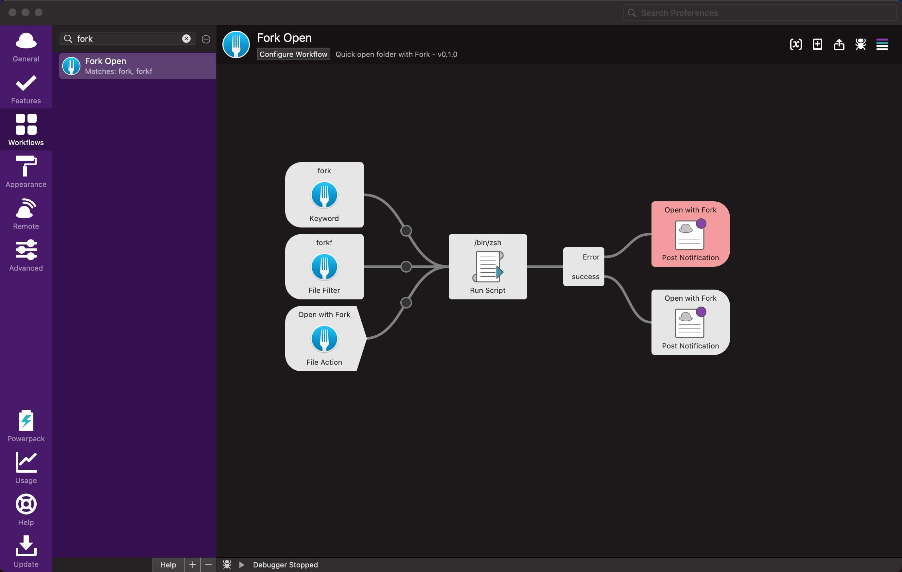

# alfred-fork-open

## Features

- Alfred 5 workflow for opening folders in Fork.

## Download
Make sure to download the latest released directly from the releases page. [Download here](https://github.com/cage1016/alfred-fork-open/releases).

## Requires
- Preferably Alfred 5

## Usage

### Open

1. Use the keyword `fork` to trigger the workflow
2. Press `enter` to open the current folder or the selected file
3. Alternatively, type a path to open (e.g., `~/Desktop`)

### Search & Open

1. Use the keyword `forkf` to trigger the workflow
2. Press `enter` or begin to type your folder search term
3. Select the folder you want to open and press `enter`

## License

This project is licensed under the MIT License. See [LICENSE](LICENSE) for details.